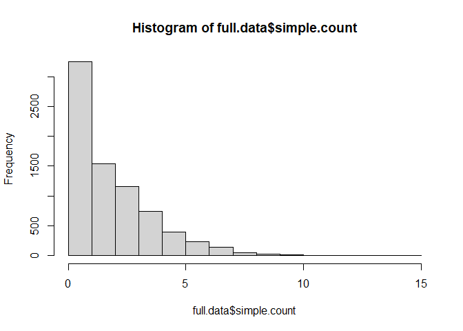

# Load data


```r
load(file = "data/fullData.RData") 
table(full.data$exposure)/sum(table(full.data$exposure))
```

```
## 
##         0         1 
## 0.5518787 0.4481213
```

```r
table(full.data$outcome)/sum(table(full.data$outcome))
```

```
## 
##         0         1 
## 0.7633487 0.2366513
```

```r
# table(full.data$exposure[full.data$outcome == 0])/
#   sum(table(full.data$exposure[full.data$outcome == 0]))
# table(full.data$outcome[full.data$exposure == 0])/
#   sum(table(full.data$outcome[full.data$exposure == 0]))
length(demovars)
```

```
## [1] 14
```

```r
demoform
```

```
## [1] "age.cat+sex+education+race+marital+income+born+diabetes.family.history+high.cholesterol+smoking+diet.healthy+physical.activity+medical.access+sleep"
```

```r
length(labvars.original) 
```

```
## [1] 10
```

```r
labvars.originalform
```

```
## [1] "uric.acid+protein.total+bilirubin.total+phosphorus+sodium+potassium+globulin+calcium.total+systolicBP+diastolicBP"
```

```r
length(labvars)
```

```
## [1] 6
```

```r
labform
```

```
## [1] "l1+l2+l3+l4+l5+l6"
```

```r
length(sel.proxy)
```

```
## [1] 94
```

```r
sel.proxy.form
```

```
## [1] "rec_dx_R73_once+rec_dx_E78_once+rec_dx_N28_once+rec_dx_N19_once+rec_dx_I10_once+rec_dx_E28_frequent+rec_dx_I63_once+rec_dx_I80_once+rec_dx_E79_once+rec_dx_I50_once+rec_dx_K76_once+rec_dx_R60_once+rec_dx_I21_once+rec_dx_I10_frequent+rec_dx_R19_once+rec_dx_D75_once+rec_dx_I50_frequent+rec_dx_M1A_once+rec_dx_I70_once+rec_dx_I20_once+rec_dx_B96_once+rec_dx_I51_once+rec_dx_N52_once+rec_dx_E87_once+rec_dx_K59_once+rec_dx_K31_once+rec_dx_R07_once+rec_dx_I99_once+rec_dx_M10_once+rec_dx_R12_once+rec_dx_R21_once+rec_dx_R35_once+rec_dx_J98_once+rec_dx_Z95_once+rec_dx_M79_once+rec_dx_N40_once+rec_dx_R39_once+rec_dx_J43_once+rec_dx_K92_once+rec_dx_K25_once+rec_dx_L08_once+rec_dx_I49_once+rec_dx_J20_once+rec_dx_L20_once+rec_dx_T88_once+rec_dx_B35_once+rec_dx_I48_once+rec_dx_H57_frequent+rec_dx_G20_once+rec_dx_H40_once+rec_dx_K21_once+rec_dx_E07_once+rec_dx_K27_once+rec_dx_L23_once+rec_dx_G31_once+rec_dx_G25_once+rec_dx_N42_once+rec_dx_R52_once+rec_dx_R32_once+rec_dx_E28_once+rec_dx_I48_frequent+rec_dx_R25_once+rec_dx_M06_once+rec_dx_H57_once+rec_dx_J42_once+rec_dx_B20_frequent+rec_dx_R05_once+rec_dx_K58_once+rec_dx_F41_once+rec_dx_R45_once+rec_dx_H10_once+rec_dx_F29_once+rec_dx_M06_frequent+rec_dx_G30_once+rec_dx_Z79_once+rec_dx_R51_once+rec_dx_L93_once+rec_dx_N30_once+rec_dx_N95_once+rec_dx_B20_once+rec_dx_G30_frequent+rec_dx_F17_once+rec_dx_J40_once+rec_dx_J02_once+rec_dx_F43_once+rec_dx_G43_once+rec_dx_N94_once+rec_dx_L70_once+rec_dx_B00_once+rec_dx_F90_once+rec_dx_N92_once+rec_dx_K08_once+rec_dx_J01_once+rec_dx_G89_once"
```

```r
length(emp.cov.names)
```

```
## [1] 142
```

```r
basicdata <- full.data[,c("idx", 
                          demovars,
                          labvars.original)]
extendeddata <- full.data[,c("idx", 
                             demovars,
                             labvars.original,
                             emp.cov.names)]
```

# Create simple count variable


```r
full.data$simple.count <- apply(full.data[sel.proxy], 1, sum)
summary(full.data$simple.count)
```

```
##    Min. 1st Qu.  Median    Mean 3rd Qu.    Max. 
##   0.000   1.000   2.000   2.281   3.000  15.000
```

```r
hist(full.data$simple.count)
```

<!-- -->

# Setup formulas


```r
rhsformula <- paste0(c(demoform, labform, "simple.count"), collapse = "+")
rhsformula
```

```
## [1] "age.cat+sex+education+race+marital+income+born+diabetes.family.history+high.cholesterol+smoking+diet.healthy+physical.activity+medical.access+sleep+l1+l2+l3+l4+l5+l6+simple.count"
```


```r
formulaOut <- as.formula(paste0("outcome ~ exposure +", rhsformula))
formulaOut
```

```
## outcome ~ exposure + age.cat + sex + education + race + marital + 
##     income + born + diabetes.family.history + high.cholesterol + 
##     smoking + diet.healthy + physical.activity + medical.access + 
##     sleep + l1 + l2 + l3 + l4 + l5 + l6 + simple.count
```
# Initial plasmode


```r
require(Plasmode)
```

```
## Loading required package: Plasmode
```

```r
ss <- 3000
# from https://cran.r-project.org/src/contrib/Archive/Plasmode/Plasmode_0.1.0.tar.gz
set.seed(111)
simdata.obj0 <- PlasmodeBin(formulaOut,
                       data=full.data,
                       idVar="idx",
                       nsim=1, 
                       size=ss, 
                       eventRate=0.2, 
                       exposedPrev=0.40)
```

```
## Deviance = 6706.222 Iterations - 1 
## Deviance = 6534.593 Iterations - 2 
## Deviance = 6522.37 Iterations - 3 
## Deviance = 6522.211 Iterations - 4 
## Deviance = 6522.211 Iterations - 5
```

```r
simdata.obj0$TrueOutBeta
```

```
##                        (Intercept)                           exposure 
##                       -2.047020844                        0.000000000 
##                       age.cat50-64                         age.cat65+ 
##                        0.539810694                        0.429726412 
##                          sexFemale               educationHigh school 
##                       -0.472156709                       -0.111935101 
## educationCollege graduate or above                          raceBlack 
##                       -0.277123446                        0.406011980 
##                       raceHispanic                         raceOthers 
##                        0.632414106                        0.859804373 
##        maritalMarried/with partner                       maritalOther 
##                        0.243870352                        0.069380525 
##           income$20,000 to $74,999             income$75,000 and Over 
##                        0.113373621                       -0.005219627 
##                    bornOther place         diabetes.family.historyYes 
##                        0.118802842                       -2.055115929 
##                high.cholesterolYes             smokingPrevious smoker 
##                        0.484460978                        0.005305600 
##              smokingCurrent smoker                   diet.healthyGood 
##                       -0.299577416                       -0.155511433 
## diet.healthyVery good or excellent               physical.activityYes 
##                       -0.407650448                       -0.189269786 
##                  medical.accessYes                              sleep 
##                        0.484449694                        0.019500869 
##                                 l1                                 l2 
##                        1.183088908                       -0.001322641 
##                                 l3                                 l4 
##                       -2.070842198                       -0.533965876 
##                                 l5                                 l6 
##                        2.975522708                       -0.242685460 
##                       simple.count 
##                        0.286782417
```

```r
length(simdata.obj0$TrueOutBeta)
```

```
## [1] 31
```

```r
simdata.obj0$RR
```

```
## [1] 1
```

```r
simdata.obj0$RD
```

```
## [1] 0
```
# Plasmode simulation


```r
nSim <- 1000
set.seed(111)
simdata.obj <- PlasmodeBin(formulaOut,
                       data=full.data,
                       idVar="idx",
                       effectOR =1,
                       nsim=nSim, 
                       size=ss, 
                       eventRate=0.3, 
                       exposedPrev=0.3,
                       MMOut = c(rep(1, length(simdata.obj0$TrueOutBeta)-2), 5))
```

```
## Deviance = 6706.222 Iterations - 1 
## Deviance = 6534.593 Iterations - 2 
## Deviance = 6522.37 Iterations - 3 
## Deviance = 6522.211 Iterations - 4 
## Deviance = 6522.211 Iterations - 5
```

```r
simdata.obj$TrueOutBeta
```

```
##                        (Intercept)                           exposure 
##                       -2.047020844                        0.000000000 
##                       age.cat50-64                         age.cat65+ 
##                        0.539810694                        0.429726412 
##                          sexFemale               educationHigh school 
##                       -0.472156709                       -0.111935101 
## educationCollege graduate or above                          raceBlack 
##                       -0.277123446                        0.406011980 
##                       raceHispanic                         raceOthers 
##                        0.632414106                        0.859804373 
##        maritalMarried/with partner                       maritalOther 
##                        0.243870352                        0.069380525 
##           income$20,000 to $74,999             income$75,000 and Over 
##                        0.113373621                       -0.005219627 
##                    bornOther place         diabetes.family.historyYes 
##                        0.118802842                       -2.055115929 
##                high.cholesterolYes             smokingPrevious smoker 
##                        0.484460978                        0.005305600 
##              smokingCurrent smoker                   diet.healthyGood 
##                       -0.299577416                       -0.155511433 
## diet.healthyVery good or excellent               physical.activityYes 
##                       -0.407650448                       -0.189269786 
##                  medical.accessYes                              sleep 
##                        0.484449694                        0.019500869 
##                                 l1                                 l2 
##                        1.183088908                       -0.001322641 
##                                 l3                                 l4 
##                       -2.070842198                       -0.533965876 
##                                 l5                                 l6 
##                        2.975522708                       -0.242685460 
##                       simple.count 
##                        1.433912087
```

```r
exp(simdata.obj$TrueOutBeta)
```

```
##                        (Intercept)                           exposure 
##                          0.1291190                          1.0000000 
##                       age.cat50-64                         age.cat65+ 
##                          1.7156820                          1.5368370 
##                          sexFemale               educationHigh school 
##                          0.6236558                          0.8941023 
## educationCollege graduate or above                          raceBlack 
##                          0.7579609                          1.5008205 
##                       raceHispanic                         raceOthers 
##                          1.8821488                          2.3626984 
##        maritalMarried/with partner                       maritalOther 
##                          1.2761789                          1.0718440 
##           income$20,000 to $74,999             income$75,000 and Over 
##                          1.1200503                          0.9947940 
##                    bornOther place         diabetes.family.historyYes 
##                          1.1261479                          0.1280780 
##                high.cholesterolYes             smokingPrevious smoker 
##                          1.6232998                          1.0053197 
##              smokingCurrent smoker                   diet.healthyGood 
##                          0.7411313                          0.8559773 
## diet.healthyVery good or excellent               physical.activityYes 
##                          0.6652114                          0.8275632 
##                  medical.accessYes                              sleep 
##                          1.6232815                          1.0196923 
##                                 l1                                 l2 
##                          3.2644422                          0.9986782 
##                                 l3                                 l4 
##                          0.1260796                          0.5862753 
##                                 l5                                 l6 
##                         19.5998656                          0.7845182 
##                       simple.count 
##                          4.1950786
```

```r
simdata.obj$RR
```

```
## [1] 1
```

```r
simdata.obj$RD
```

```
## [1] 0
```


```r
simdata <- simdata.obj$Sim_Data 
```

# Save


```r
save.image(file = "data/plasmode.RData")
```
